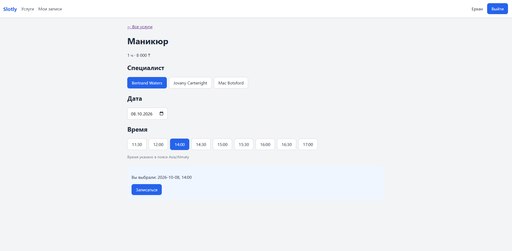

# Slotly Web


React client for [Slotly API](https://github.com/djakhanov980909/slotly-api), an appointment-booking
service. Browse services, pick a specialist, a date and a free time slot, and manage your bookings.



## Features

- Registration, login and logout with Bearer-token authentication
- Protected routes; the session survives a page reload
- Service catalogue and a service page with specialist, date and time-slot selection
- Booking with clear handling of conflicts (HTTP 409): the taken slot disappears from the list
- "My bookings" page with cancellation; the server decides whether cancelling is allowed

## Tech

React, TypeScript, Vite, React Router, TanStack Query, ESLint, GitHub Actions.

## Design decisions

- **Server state with TanStack Query.** Loading, error and empty states are handled explicitly;
  after a booking or a cancellation the affected queries are invalidated, so the UI never shows stale slots.
- **One API client.** A small `fetch` wrapper adds the `Authorization` header, parses Laravel
  validation errors (422) into field-level messages and throws a typed `ApiError`.
- **Auth in a context.** `AuthProvider` restores the user from the stored token on load and shows a
  loading state, so a reload does not flash the login page.
- **Business rules stay on the server.** The API returns `can_cancel` for each booking, so the client
  does not duplicate the cancellation policy.
- **Token in `localStorage`** is a deliberate trade-off: it keeps the API independent from the client,
  but it is exposed to XSS. Laravel Sanctum's cookie-based SPA mode with `HttpOnly` cookies would be a
  safer alternative for a first-party client.
- Slot times are shown in the business time zone returned by the API.

## Getting started

Requires Node.js 22+ and a running [Slotly API](https://github.com/djakhanov980909/slotly-api).

```bash
git clone git@github.com:djakhanov980909/slotly-web.git
cd slotly-web
cp .env.example .env.local
npm install
npm run dev
```

Open http://localhost:5173. The API URL is set in `.env.local` (`VITE_API_URL`).
The API must allow this origin in `CORS_ALLOWED_ORIGINS`.

## Scripts

| Command | Description |
|---|---|
| `npm run dev` | Start the dev server |
| `npm run build` | Type-check and build for production |
| `npm run lint` | Run ESLint |